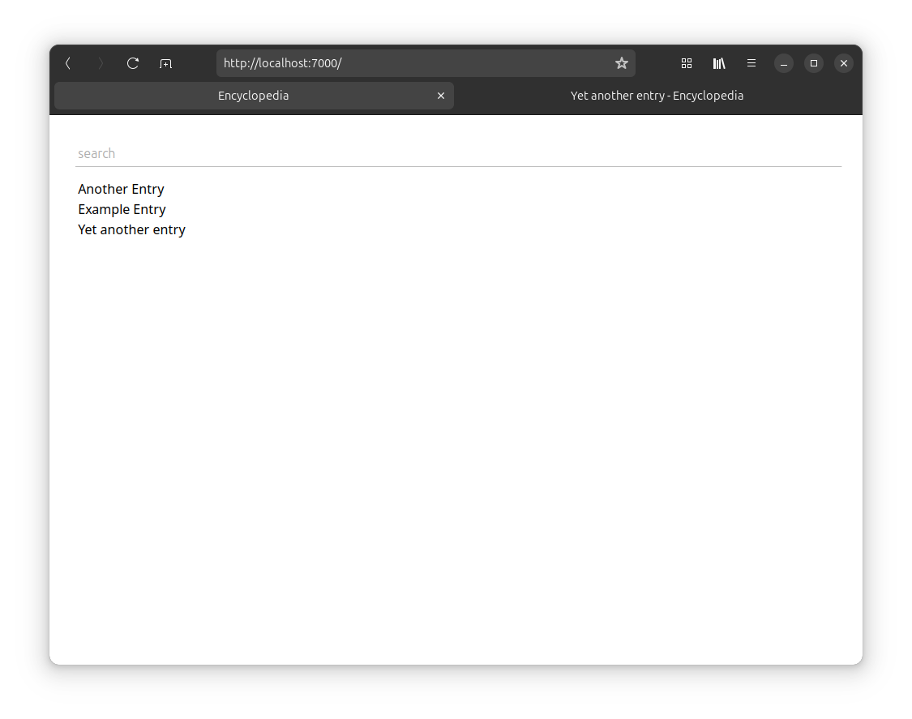
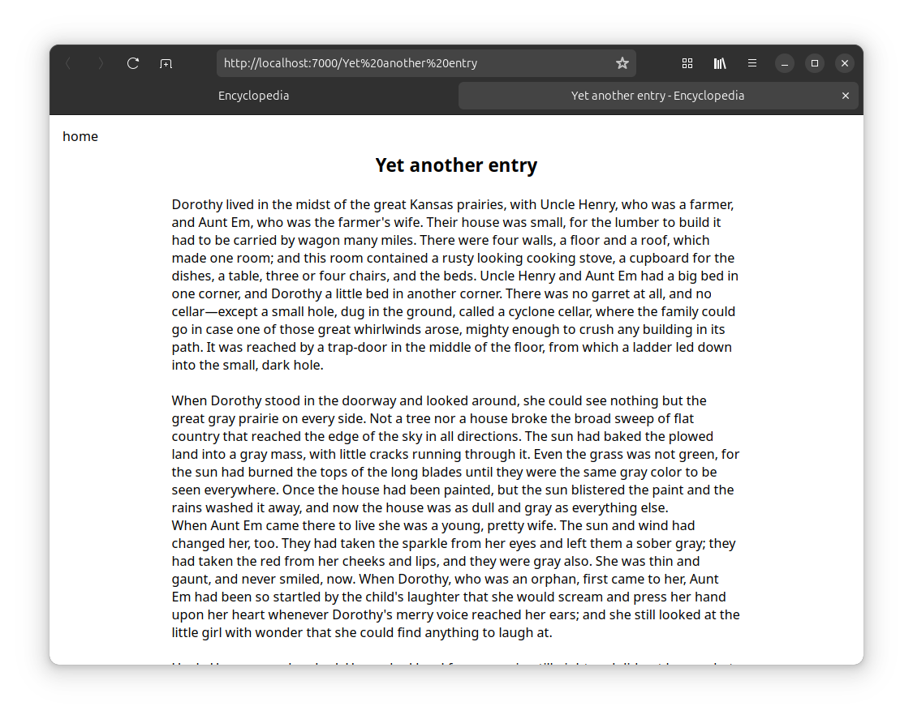

# Plaintext Encyclopedia

A very simple and clean reader/browser? for plaintext... documentation? wiki? chapters of a book? whatever.




## How to use

1. Set your settings in `settings.go`
2. Modify the application (if you want)
3. Compile `go get && go build -o server`
4. Place your `.txt` files into `entries/` (see section "Formatting" below)
5. Run `./server`
6. put behind a proxy (or don't).

### Formatting

The only formatting option you have: to define a title.

```
Title: A title

here comes the entry body ...
```

It has to be defined in the first line of the text file.  
If you don't define a title, the filename without the `.txt` part gets used as the title.

## Requirements

Developed and tested on Linux. Should work on other Unixoids.
