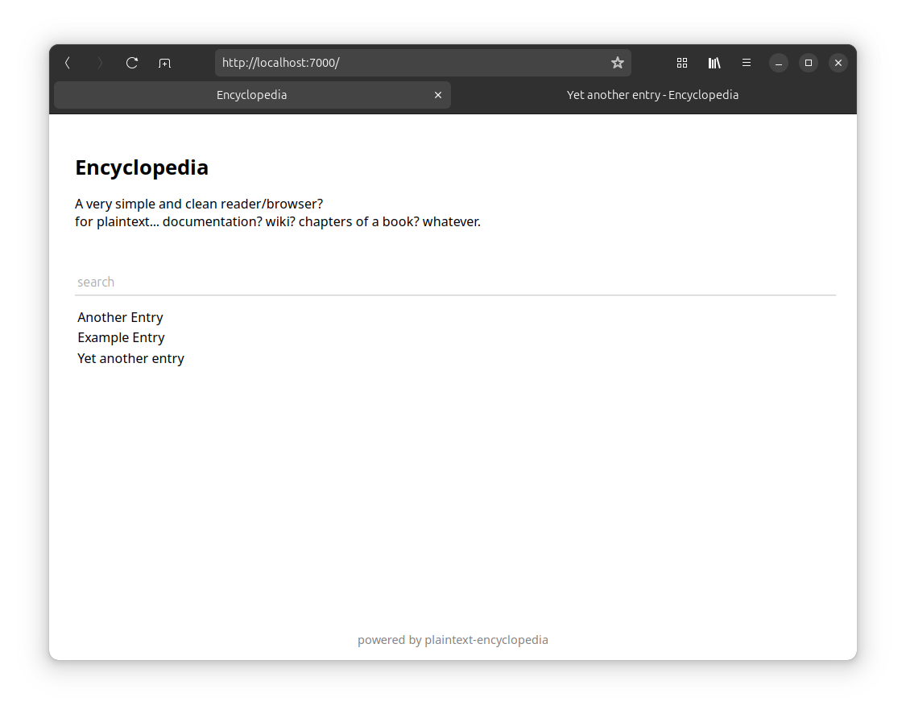
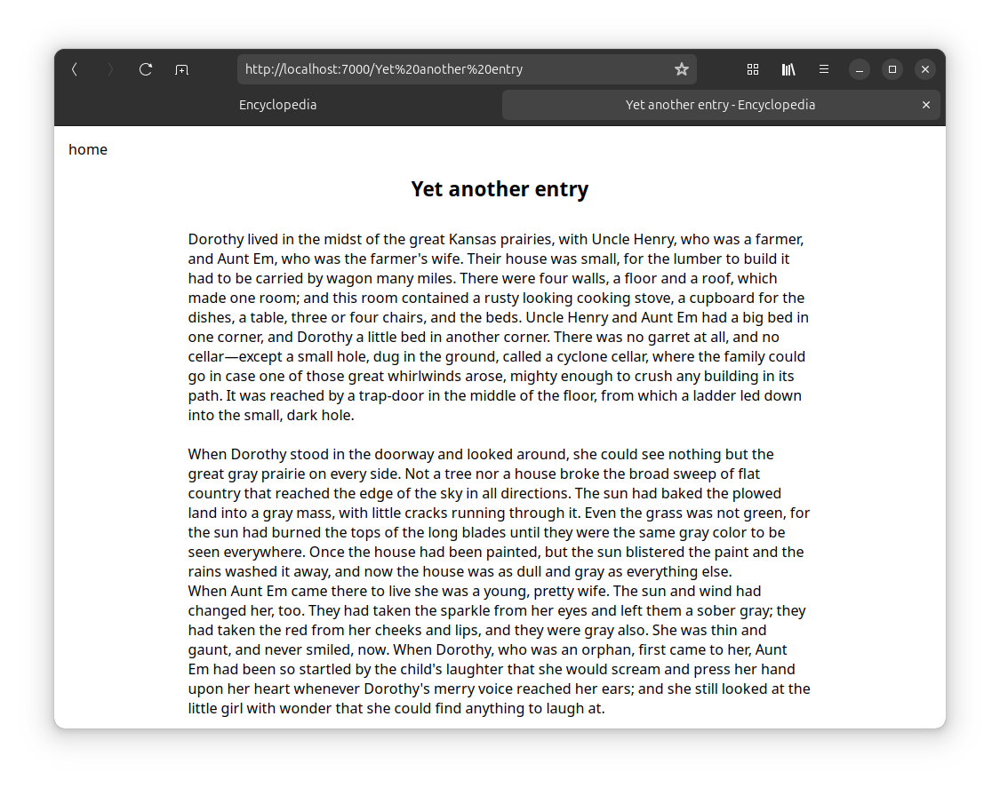

# Plaintext Encyclopedia

A very simple and clean reader/browser? for plaintext... documentation? wiki? chapters of a book? whatever.

## How to use

1. Set your settings in `settings.go`
2. Modify (if you want)
3. Compile `go get && go build -o server`
4. Place your content into `entries/`
5. Run `./server`
6. put behind a proxy (or don't).

## Requirements

Developed and tested on Linux. Should work on other Unixoids.
